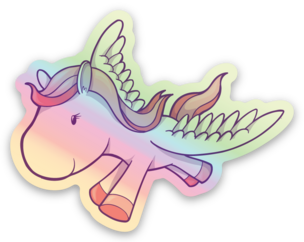

# Django Software Foundation design assets

See [source designs in Figma](https://www.figma.com/design/RhKoSUiYXSWy4d8a2ZS8Ht/DSF-%26-Django-design-assets).

## Font

The Django logo uses [DTL Prokyon](http://www.dutchtypelibrary.nl/Prokyon_rdrct.html), specifically "DTL Prokyon T". Note the ear of `g` in the logo has been truncated for better letter spacing with the `o`.

## Logo

Files relating to the [official Django logo](https://www.djangoproject.com/community/logos/), including a shortened "dj" version.

## Pony mascot

The [Django pony](https://djangopony.com/) is available on iStock Photo: [Fairy Tale Vector Elements stock illustration](https://www.istockphoto.com/vector/fairy-tale-vector-elements-gm91230581-3355498?st=3eb57c4). They were created by Erik DePrince. Reuse of the iStock Photo assets requires a paid license, and can only be within the permitted uses of the license. In particular, unless specially purchased, the license only allows a single user of the source files. See [extended license](https://www.istockphoto.com/help/licenses).

Here’s a sample of using the pony, as a [Sticker Mule holographic sticker](https://www.stickermule.com/products/holographic-stickers):

## Unofficial brand colors

| Color                   | Hex code  | Origin                                                              |
| ----------------------- | --------- | ------------------------------------------------------------------- |
| Official green          | `#092E20` | [Website logo page](https://www.djangoproject.com/community/logos/) |
| Website text            | `#0C3C26` | Website CSS                                                         |
| Website dark green      | `#0C4B33` | Website CSS                                                         |
| Website secondary green | `#20AA76` | Website CSS                                                         |
| Website light green     | `#93D7B7` | Website CSS                                                         |
| Secondary lime          | `#89E7C3` | Website CSS                                                         |
| Official white          | `#FFFFFF` | It’s white                                                          |
| Website dark red        | `#6A0E0E` | Website CSS                                                         |
| Django Girls+ orange    | `#FF8D02` | [DjangoGirls/resources](https://github.com/DjangoGirls/resources)   |
| Django pony light pink  | `#F6BFCD` | [Django pony](https://djangopony.com/)                              |
| Django pony pink        | `#F18197` | [Django pony](https://djangopony.com/)                              |
| Django pony purple      | `#642982` | [Django pony](https://djangopony.com/)                              |

## Stickers and pins

During DjangoCon Europe 2023 on the first day, we made a bunch of DSF designs for use as pins or stickers.

## Accessibility team

Using the base pony design, combined with added visuals symbolizing different accessibility needs.

- The sunglasses represent visual impairments. It comes [from the Noun project](https://thenounproject.com/icon/sunglasses-6294988/) image #6294988, art by [M Syaiful Anshari](https://thenounproject.com/creator/ansharyms/).
- The cane also represents visual impairments. It comes [from OpenMoji - white cane](https://openmoji.org/library/emoji-1F9AF/).
- The wheelchair represents mobility impairments.
- The cast represents a broken leg - trying to speak to the social model of accessibility (it’s not just permanent conditions).

We also considered a [sunflower hidden disability pony](https://hdsunflower.com/). That will likely make it for a future set.
