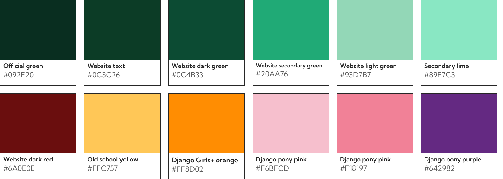

# Django Software Foundation design assets

See [source designs in Figma](https://www.figma.com/design/RhKoSUiYXSWy4d8a2ZS8Ht/DSF-%26-Django-design-assets).

## Stickers and pins

During DjangoCon Europe 2023 on the first day, we made a bunch of DSF designs for use as pins or stickers.

## Logo

Files relating to the [official Django logo](https://www.djangoproject.com/community/logos/), including a shorened "dj" version.

## Unofficial brand colors

| Color                   | Hex code  | Origin                                                              |
| ----------------------- | --------- | ------------------------------------------------------------------- |
| Official green          | `#092E20` | [Website logo page](https://www.djangoproject.com/community/logos/) |
| Website text            | `#0C3C26` | Website CSS                                                         |
| Website dark green      | `#0C4B33` | Website CSS                                                         |
| Website secondary green | `#20AA76` | Website CSS                                                         |
| Website light green     | `#93D7B7` | Website CSS                                                         |
| Secondary lime          | `#89E7C3` | Website CSS                                                         |
| Official white          | `#FFFFFF` | It’s white                                                          |
| Website dark red        | `#6A0E0E` | Website CSS                                                         |
| Django Girls+ orange    | `#FF8D02` | [DjangoGirls/resources](https://github.com/DjangoGirls/resources)   |
| Django pony light pink  | `#F6BFCD` | [Django pony](https://djangopony.com/)                              |
| Django pony pink        | `#F18197` | [Django pony](https://djangopony.com/)                              |
| Django pony purple      | `#642982` | [Django pony](https://djangopony.com/)                              |

## Accessibility team

